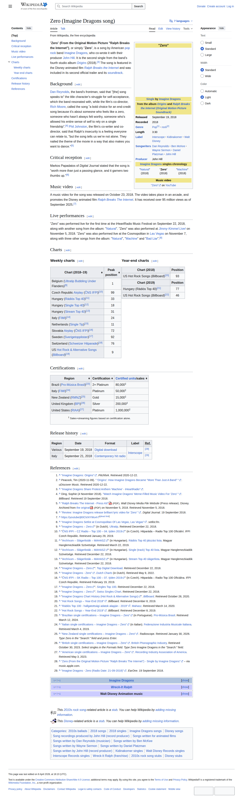

# Visited: https://en.wikipedia.org/wiki/Zero_%28Imagine_Dragons_song%29
**Time:** Thu May 14 13:18:05 UTC 2026

## Screenshot

## Raw HTML
[page.html](./page.html)

## Downloaded Media (5 files)
## Downloaded Media Files

- [RalphBreaksTheInternet5bdce2c0c0501.pdf](./media/RalphBreaksTheInternet5bdce2c0c0501.pdf) (4085 KB)

## Other Links
- [#](#)
- [#Background](#Background)
- [#Certifications](#Certifications)
- [#Charts](#Charts)
- [#Critical_reception](#Critical_reception)
- [#Live_performances](#Live_performances)
- [#Music_video](#Music_video)
- [#References](#References)
- [#Release_history](#Release_history)
- [#Weekly_charts](#Weekly_charts)
- [#Year-end_charts](#Year-end_charts)
- [#bodyContent](#bodyContent)
- [#cite_note-1](#cite_note-1)
- [#cite_note-15](#cite_note-15)
- [#cite_note-2](#cite_note-2)
- [#cite_note-20](#cite_note-20)
- [#cite_note-21](#cite_note-21)
- [#cite_note-22](#cite_note-22)
- [#cite_note-28](#cite_note-28)
- [#cite_note-29](#cite_note-29)
- [#cite_note-3](#cite_note-3)
- [#cite_note-4](#cite_note-4)
- [#cite_note-6](#cite_note-6)
- [#cite_note-7](#cite_note-7)
- [#cite_note-8](#cite_note-8)
- [#cite_note-BrazilImagine_DragonsZerosingleCertRef-23](#cite_note-BrazilImagine_DragonsZerosingleCertRef-23)
- [#cite_note-ItalyImagine_DragonsZerosingleCertRef-24](#cite_note-ItalyImagine_DragonsZerosingleCertRef-24)
- [#cite_note-New_ZealandImagine_DragonsZerosingleCertRef-25](#cite_note-New_ZealandImagine_DragonsZerosingleCertRef-25)
- [#cite_note-PressKit-5](#cite_note-PressKit-5)
- [#cite_note-United_KingdomImagine_DragonsZerosingleCertRef-26](#cite_note-United_KingdomImagine_DragonsZerosingleCertRef-26)
- [#cite_note-United_StatesImagine_DragonsZerosingleCertRef-27](#cite_note-United_StatesImagine_DragonsZerosingleCertRef-27)
- [#cite_note-sc_Billboardrocksongs_Imagine_Dragons-19](#cite_note-sc_Billboardrocksongs_Imagine_Dragons-19)
- [#cite_note-sc_Czech_Republic_-10](#cite_note-sc_Czech_Republic_-10)
- [#cite_note-sc_Flanders_Tip_Imagine_Dragons-9](#cite_note-sc_Flanders_Tip_Imagine_Dragons-9)
- [#cite_note-sc_Hungary_-11](#cite_note-sc_Hungary_-11)
- [#cite_note-sc_Hungarysingle_-12](#cite_note-sc_Hungarysingle_-12)
- [#cite_note-sc_Hungarystream_-13](#cite_note-sc_Hungarystream_-13)
- [#cite_note-sc_Italy_Imagine_Dragons-14](#cite_note-sc_Italy_Imagine_Dragons-14)
- [#cite_note-sc_Slovakia2_-16](#cite_note-sc_Slovakia2_-16)
- [#cite_note-sc_Switzerland_Imagine_Dragons-18](#cite_note-sc_Switzerland_Imagine_Dragons-18)
- [#cite_note-swe-17](#cite_note-swe-17)
- [#cite_ref-1](#cite_ref-1)
- [#cite_ref-15](#cite_ref-15)
- [#cite_ref-2](#cite_ref-2)
- [#cite_ref-20](#cite_ref-20)
- [#cite_ref-21](#cite_ref-21)
- [#cite_ref-22](#cite_ref-22)
- [#cite_ref-28](#cite_ref-28)
- [#cite_ref-29](#cite_ref-29)
- [#cite_ref-3](#cite_ref-3)

## Stats
- Links: 551
- Media: 5
