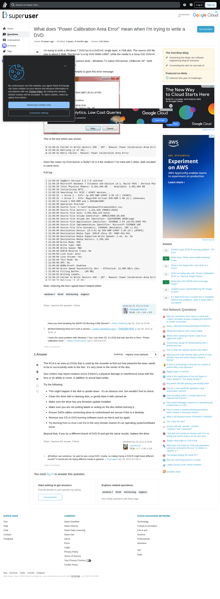

# Visited: https://superuser.com/questions/416769/what-does-power-calibration-area-error-mean-when-im-trying-to-write-a-dvd
**Time:** Wed May 13 19:19:35 UTC 2026

## Screenshot

## Raw HTML
[page.html](./page.html)

## Downloaded Media (2 files)
## Downloaded Media Files

## Other Links
- [#](#)
- [#content](#content)
- [/](/)
- [/a/416807](/a/416807)
- [/contact](/contact)
- [/feeds/question/416769](/feeds/question/416769)
- [/help](/help)
- [/opensearch.xml](/opensearch.xml)
- [/posts/416769/edit](/posts/416769/edit)
- [/posts/416769/ivc/208c?prg=073aba16-2a83-4bf1-ba63-56199f4c1c4d](/posts/416769/ivc/208c?prg=073aba16-2a83-4bf1-ba63-56199f4c1c4d)
- [/posts/416769/timeline](/posts/416769/timeline)
- [/posts/416807/edit](/posts/416807/edit)
- [/posts/416807/timeline](/posts/416807/timeline)
- [/px.js?ch=1](/px.js?ch=1)
- [/px.js?ch=2](/px.js?ch=2)
- [/q/416769](/q/416769)
- [/questions](/questions)
- [/questions/1588203/unable-to-burn-memtest86-img-efi-image-to-dvd](/questions/1588203/unable-to-burn-memtest86-img-efi-image-to-dvd)
- [/questions/1678153/if-a-data-dvd-has-a-scratch-but-is-readable-without-any-problems-does-it-mean-d](/questions/1678153/if-a-data-dvd-has-a-scratch-but-is-readable-without-any-problems-does-it-mean-d)
- [/questions/215372/what-does-write-cache-buffer-flushing-mean](/questions/215372/what-does-write-cache-buffer-flushing-mean)
- [/questions/416769/what-does-power-calibration-area-error-mean-when-im-trying-to-write-a-dvd](/questions/416769/what-does-power-calibration-area-error-mean-when-im-trying-to-write-a-dvd)
- [/questions/416769/what-does-power-calibration-area-error-mean-when-im-trying-to-write-a-dvd?answertab=scoredesc#tab-top](/questions/416769/what-does-power-calibration-area-error-mean-when-im-trying-to-write-a-dvd?answertab=scoredesc#tab-top)
- [/questions/597929/what-is-the-largest-file-i-can-write-to-a-dvd](/questions/597929/what-is-the-largest-file-i-can-write-to-a-dvd)
- [/questions/606616/dvd-recording-fails-with-power-calibration-error-or-internal-target-failure](/questions/606616/dvd-recording-fails-with-power-calibration-error-or-internal-target-failure)
- [/questions/619250/what-does-this-bsod-error-message-mean](/questions/619250/what-does-this-bsod-error-message-mean)
- [/questions/93168/double-layer-dvdr-burning-problem-i-o-error](/questions/93168/double-layer-dvdr-burning-problem-i-o-error)
- [/questions/ask](/questions/ask)
- [/questions/tagged/64-bit](/questions/tagged/64-bit)
- [/questions/tagged/dvd-burning](/questions/tagged/dvd-burning)
- [/questions/tagged/imgburn](/questions/tagged/imgburn)
- [/questions/tagged/windows-7](/questions/tagged/windows-7)
- [/tags](/tags)
- [/tour](/tour)
- [/unanswered](/unanswered)
- [/users](/users)
- [/users/19548/niklas-rosencrantz](/users/19548/niklas-rosencrantz)
- [/users/36744/oliver-salzburg](/users/36744/oliver-salzburg)
- [/users/4377/sathyajith-bhat](/users/4377/sathyajith-bhat)
- [/users/51705/lawrencec](/users/51705/lawrencec)
- [/users/98855/psycogeek](/users/98855/psycogeek)
- [/users/login?ssrc=question_page&amp;returnurl=https%3a%2f%2fsuperuser.com%2fquestions%2f416769](/users/login?ssrc=question_page&amp;returnurl=https%3a%2f%2fsuperuser.com%2fquestions%2f416769)
- [?lastactivity](?lastactivity)
- [https://academia.stackexchange.com/questions/226668/how-to-mitigate-a-pass-fail-in-a-very-relevant-class](https://academia.stackexchange.com/questions/226668/how-to-mitigate-a-pass-fail-in-a-very-relevant-class)
- [https://ajax.googleapis.com/ajax/libs/jquery/3.7.1/jquery.min.js](https://ajax.googleapis.com/ajax/libs/jquery/3.7.1/jquery.min.js)
- [https://api.stackexchange.com/](https://api.stackexchange.com/)
- [https://blender.stackexchange.com/questions/346659/how-to-cycle-through-and-layer-multiple-textures](https://blender.stackexchange.com/questions/346659/how-to-cycle-through-and-layer-multiple-textures)
- [https://blender.stackexchange.com/questions/346665/how-to-create-a-seamless-looping-procedural-noise-texture-in-geometry-nodes](https://blender.stackexchange.com/questions/346665/how-to-create-a-seamless-looping-procedural-noise-texture-in-geometry-nodes)
- [https://cdn.cookielaw.org/scripttemplates/gpp.stub.js](https://cdn.cookielaw.org/scripttemplates/gpp.stub.js)
- [https://cdn.cookielaw.org/scripttemplates/otSDKStub.js](https://cdn.cookielaw.org/scripttemplates/otSDKStub.js)
- [https://chat.stackexchange.com?tab=site&amp;host=superuser.com](https://chat.stackexchange.com?tab=site&amp;host=superuser.com)

## Stats
- Links: 150
- Media: 2
